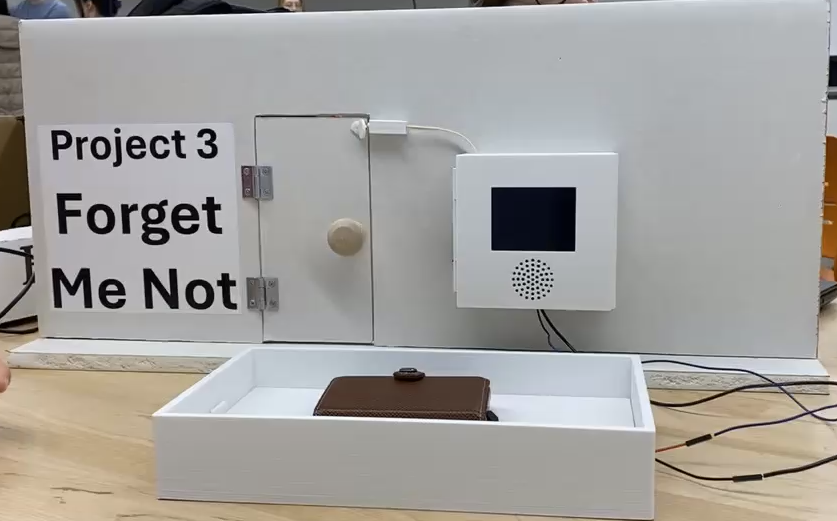

# Forget Me Not – Smart Item Reminder System

# Forget Me Not – Smart Item Reminder System

## 📖 Overview
**Forget Me Not** is an embedded smart reminder system designed to prevent you from forgetting essential items (like your wallet, keys, or phone) when leaving your home.  

You place your item on the tray, and when you open the door to leave, the system checks:  
- If the item is still on the tray → the screen flashes and the speaker sounds an alarm to remind you to take it.  
- If the tray is empty (meaning you already picked up your item) → nothing happens and you can leave as normal.  

This way, the system prevents you from forgetting essentials before walking out the door.  

Under the hood, the system uses a **Raspberry Pi Pico**, a **magnetic door sensor**, and a **photoresistor-based tray sensor**. When the door opens, these inputs are processed in real time to determine whether to trigger an alarm. The design also integrates **Phase-Locked Loops (PLLs)** to lower the clock frequency when full performance isn’t needed, reducing power draw and extending battery life.  

---

## Demo Video
**Click on Image Below to Watch**

[](https://youtu.be/QnvRQJowsJ8))

---

## ⚡ Features
- **Real-time item detection** using a photoresistor tray sensor.  
- **Magnetic door sensor** to trigger events when the door opens.  
- **Speaker & screen alerts** for immediate user feedback.  
- **Embedded design on Raspberry Pi Pico** for reliable, low-power operation.  

---

## 🛠️ Tech Stack & Components
- **Microcontroller**: Raspberry Pi Pico (C/C++ SDK)  
- **Sensors**:  
  - Magnetic door sensor (detects door open/close events)  
  - Photoresistor (detects presence of items on tray)  
- **Output Devices**:  
  - Speaker (audible alarm)  
  - Screen (visual notification)  
- **Programming**: C/C++ (Pico SDK), MicroPython (optional for prototyping)  
- **Design Focus**: Embedded systems, low-power optimization, human-centric IoT  

---

## 🔧 How It Works
1. Place your essential item (e.g., wallet) on the tray.  
2. When the door opens, the system checks tray status via the photoresistor.  
3. - If the item is still on the tray → **alarm triggers** (screen + speaker).  
   - If the tray is empty (item taken with you) → **no alarm**.  
4. PLL-based logic lowers clock frequency when idle, reducing power draw.  

---

## 🚀 Setup & Installation
1. Clone this repository:
   ```bash
   git clone https://github.com/yourusername/forget-me-not.git
   cd forget-me-not
